# CliniTrack

**Modern Flutter Clinic Management App for Doctors**

CliniTrack is a clean, offline-first mobile application designed for physicians to efficiently manage their clinic operations. From patient records and appointments to prescriptions, medicine inventory, and follow-ups — everything is organized in one beautiful, easy-to-use interface with full light & dark theme support.

---

## Screenshots

<p align="center">
  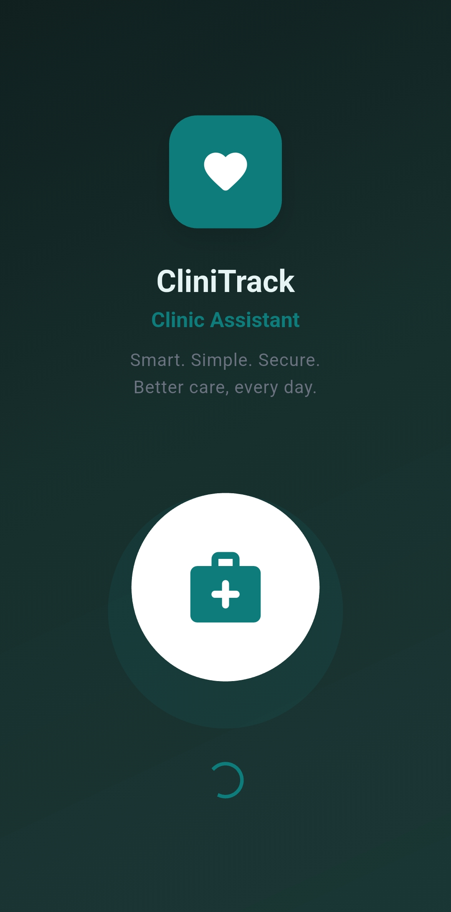
  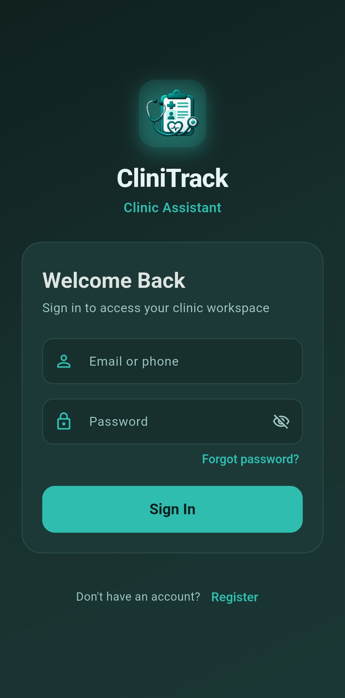
  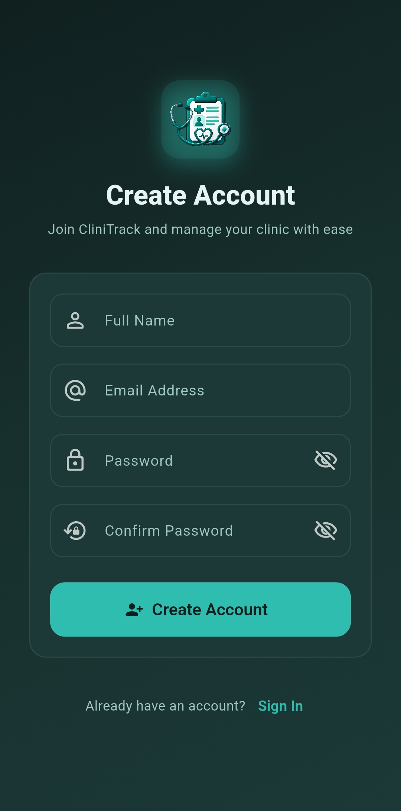
  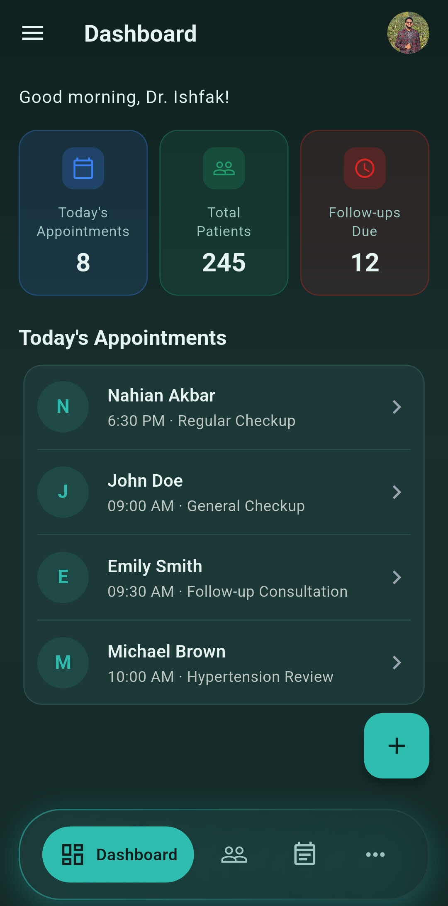
</p>

<p align="center">
  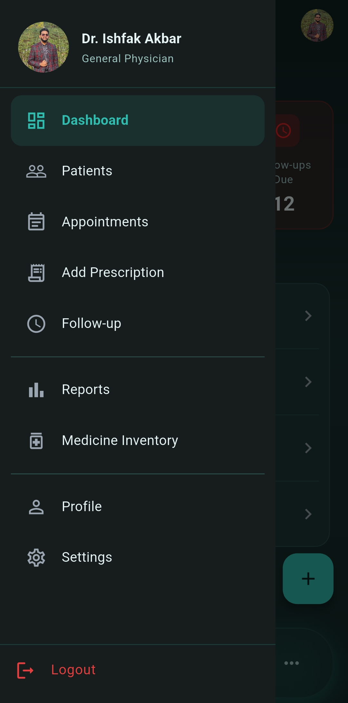
  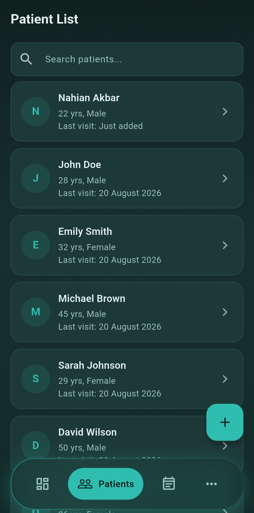
  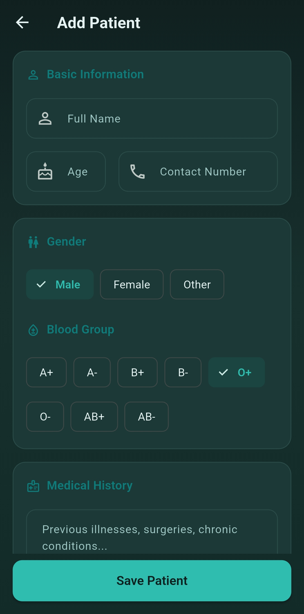
  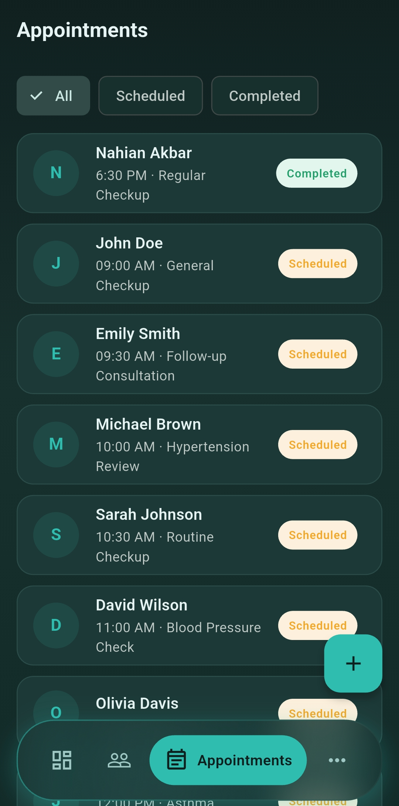
</p>

<p align="center">
  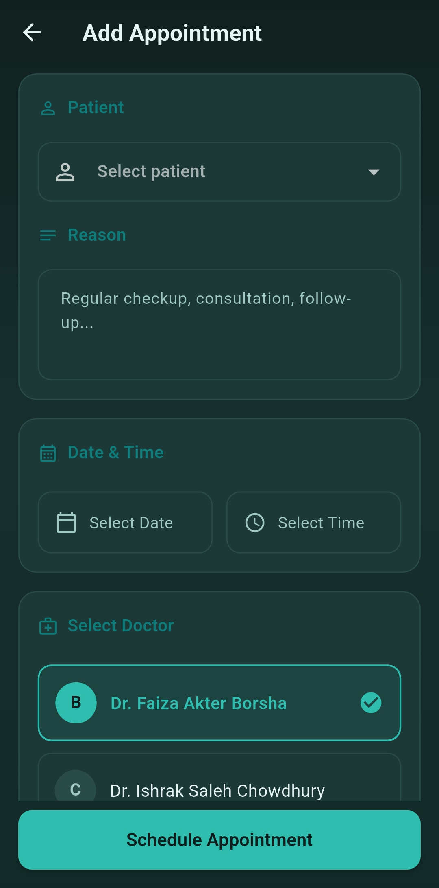
  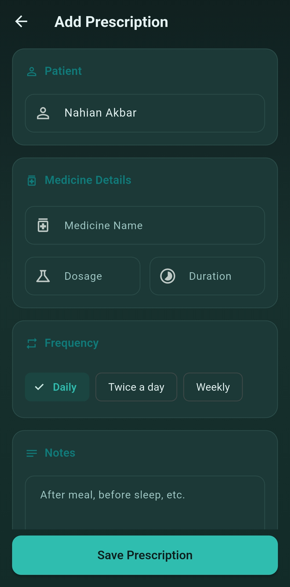
  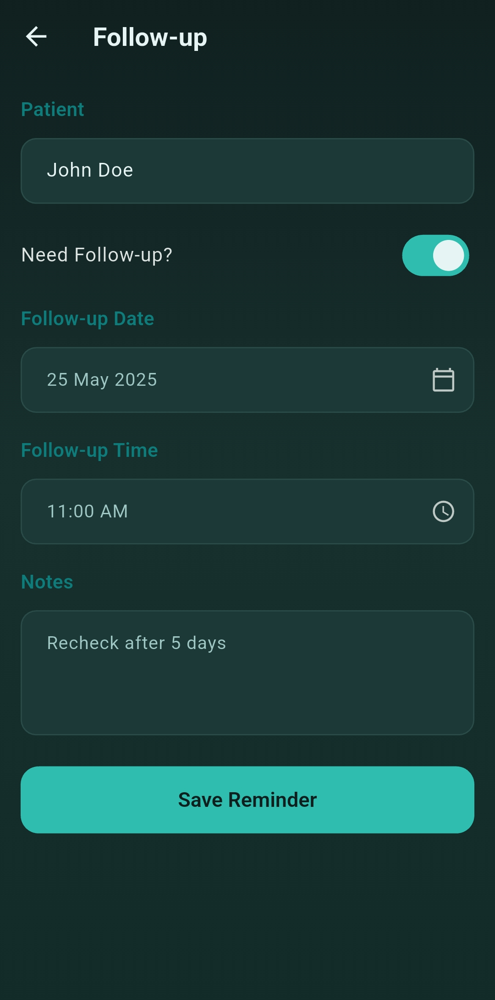
  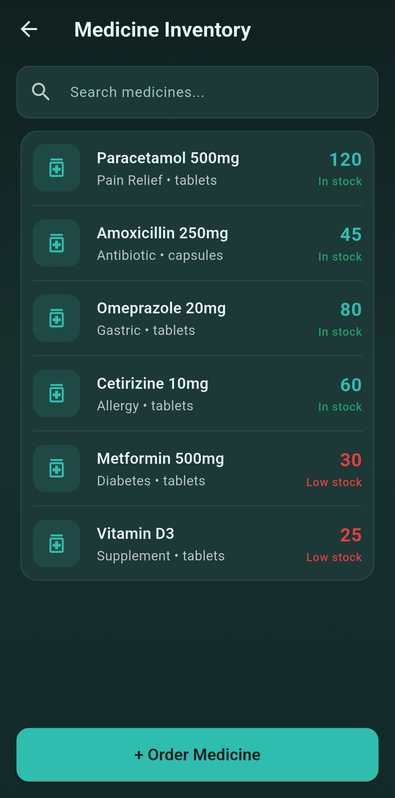
</p>

<p align="center">
  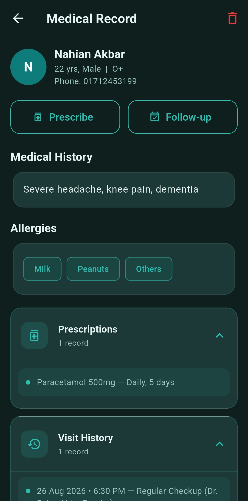
  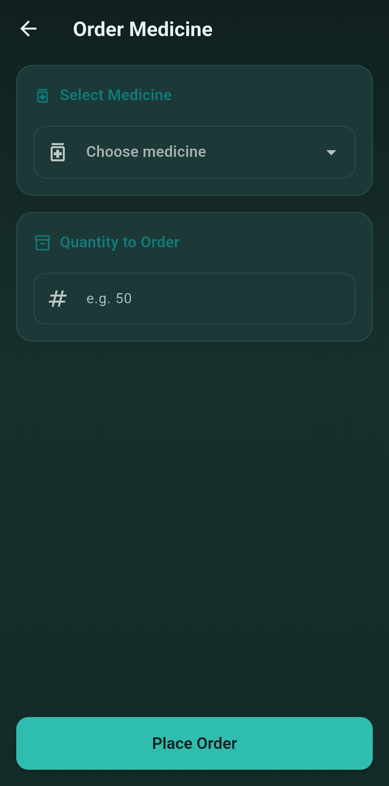
  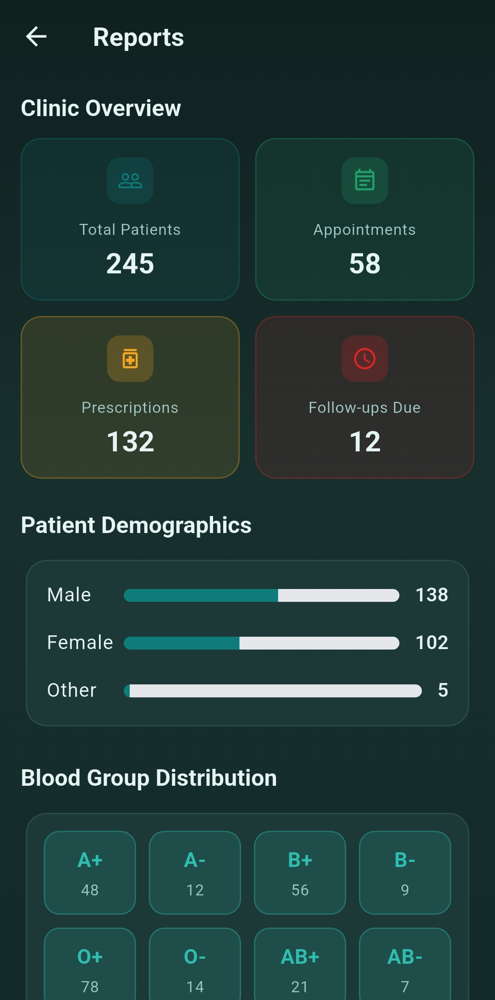
  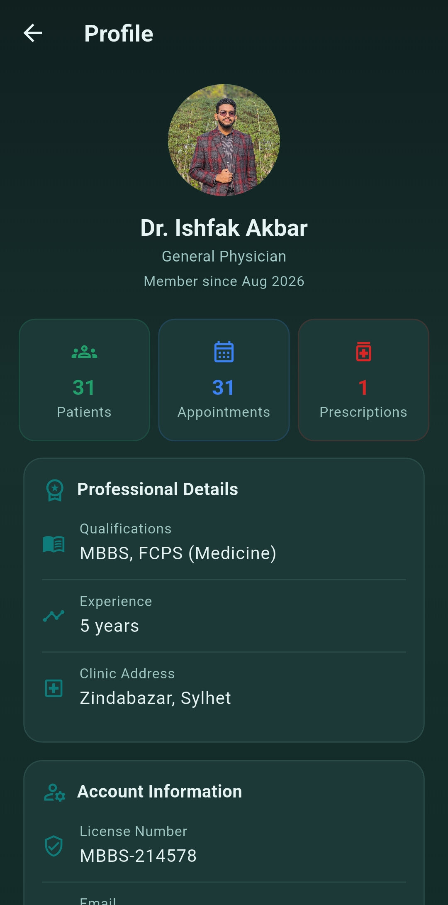
</p>

<p align="center">
  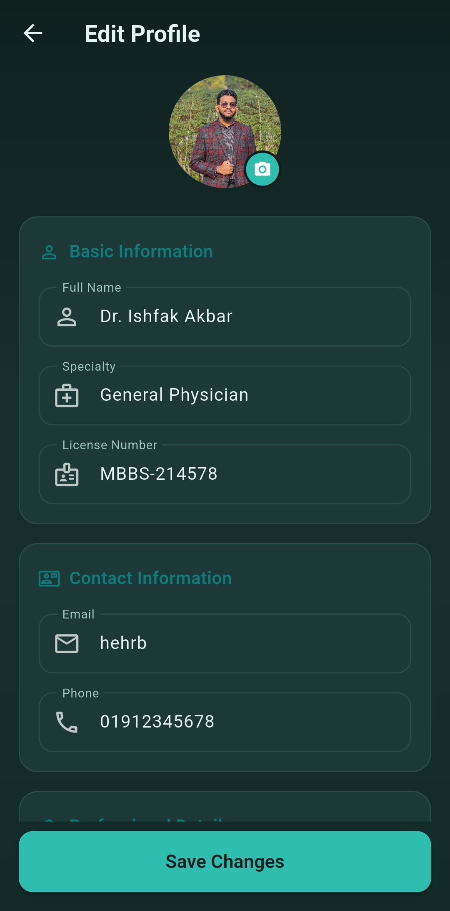
  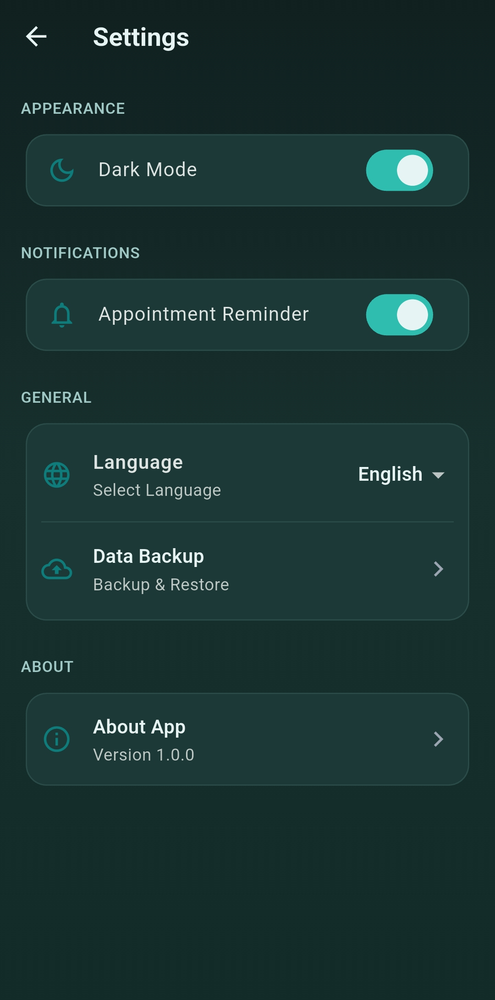
</p>

---

## Features

### Authentication & Session
- Secure login and registration for doctors
- Persistent session using SharedPreferences
- Automatic redirect based on login state (Splash screen)

### Dashboard
- Personalized greeting
- Quick statistics cards:
  - Today’s Appointments
  - Total Patients
  - Follow-ups Due
- Today’s appointment list with quick overview

### Patient Management
- Searchable patient list
- Add new patients with detailed information
- View complete patient details
- Expandable medical records section

### Appointments
- View all appointments
- Schedule new appointments
- Clean appointment cards with date, time & patient info

### Prescriptions
- Create and manage prescriptions for patients
- Easy-to-use prescription form

### Follow-ups
- Track pending and upcoming follow-up visits
- Clear visual indicators for due follow-ups

### Medicine Management
- Browse medicine inventory
- Order new medicines
- View medicine records

### Reports
- Clinic overview with key metrics
- Total patients, appointments, and other statistics

### Profile & Settings
- View and edit doctor profile (name, specialty, license, qualifications, experience, clinic address, bio)
- Light / Dark mode toggle
- Clean settings screen

### UI / UX
- Modern teal-based design system
- Fully responsive light & dark themes
- Bottom navigation + side drawer
- Consistent cards, chips, and form sections
- Floating Action Button for quick actions

---

## Tech Stack

| Layer              | Technology                          |
|--------------------|-------------------------------------|
| Framework          | Flutter                             |
| Language           | Dart                                |
| State Management   | Provider (`ChangeNotifier`)         |
| Local Storage      | SharedPreferences                   |
| Architecture       | Feature-based (screens / providers / widgets / utils) |
| Theming            | Custom light & dark themes          |

---

## Getting Started

### Prerequisites
- Flutter SDK (3.x or higher)
- Android Studio / VS Code with Flutter & Dart extensions
- An Android/iOS emulator or physical device

### Installation

```bash
# 1. Clone the repository
git clone https://github.com/your-username/cliniTrack.git
cd cliniTrack

# 2. Install dependencies
flutter pub get

# 3. Run the app
flutter run

```

## Project Structure
lib/
├── main.dart                      # App entry point + MultiProvider setup
├── providers/
│   ├── auth_provider.dart         # Login, session & profile
│   ├── patient_provider.dart      # Patient data
│   ├── appointment_provider.dart  # Appointments
│   ├── prescription_provider.dart # Prescriptions
│   ├── medicine_provider.dart     # Medicines
│   └── settings_provider.dart     # Theme & settings
├── screens/
│   ├── splash_screen.dart
│   ├── login_screen.dart
│   ├── registration_screen.dart
│   ├── dashboard_screen.dart
│   ├── patient_list_screen.dart
│   ├── add_patient_screen.dart
│   ├── patient_details_screen.dart
│   ├── appointments_screen.dart
│   ├── add_appointment_screen.dart
│   ├── add_prescription_screen.dart
│   ├── follow_up_screen.dart
│   ├── medicine_list_screen.dart
│   ├── order_medicine_screen.dart
│   ├── reports_screen.dart
│   ├── profile_screen.dart
│   ├── edit_profile_screen.dart
│   ├── settings_screen.dart
│   └── more_screen.dart
├── widgets/                       # Reusable components
│   ├── app_scaffold.dart
│   ├── app_drawer.dart
│   ├── app_bottom_nav.dart
│   ├── dashboard_stat_card.dart
│   ├── patient_list_tile.dart
│   ├── appointment_list_tile.dart
│   └── ...
└── utils/
├── app_colors.dart            # Color palette
└── app_theme.dart             # Light & Dark themes


---

## Screens Overview

| Screen                | Purpose                                      |
|-----------------------|----------------------------------------------|
| Splash                | Session check + load all local data          |
| Login / Registration  | Doctor authentication                        |
| Dashboard             | Overview + today’s appointments              |
| Patient List          | Search & browse patients                     |
| Add / Details Patient | Create & view full patient records           |
| Appointments          | Manage clinic appointments                   |
| Add Prescription      | Write prescriptions                          |
| Follow-up             | Track pending follow-ups                     |
| Medicine List         | Inventory overview                           |
| Order Medicine        | Request new stock                            |
| Reports               | Clinic performance statistics                |
| Profile               | Doctor information                           |
| Edit Profile          | Update personal & professional details       |
| Settings              | Theme toggle and app preferences             |

---

## Color Palette

- **Primary Teal**: `#0E7C7B`
- **Success Green**: `#22A06B`
- **Follow-up / Alert**: `#DC2626`
- Full light & dark mode support

---

## License

This project is open source and available under the [MIT License](LICENSE).

---

**Built with Flutter • Designed for real clinic workflows**
