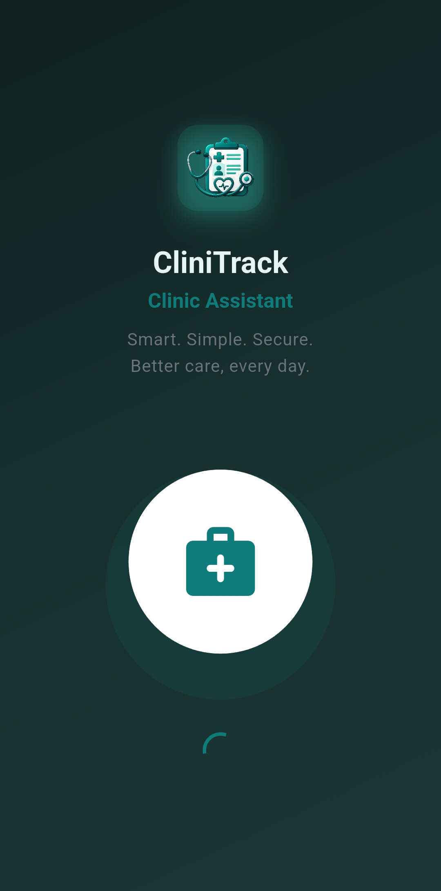

# 🩺 CliniTrack

**Clinic management app for doctors and patients — Flutter + Supabase**

CliniTrack gives doctors a full practice workspace (patients, appointments, prescriptions, follow-ups, medicine inventory, reports) and gives patients a self-service portal (book visits, track approvals, view prescriptions and reminders). It runs **offline-first**: with Supabase configured it syncs to the cloud; without keys it falls back to on-device storage, so a fresh clone works immediately.

---

## 📸 Screenshots

<p align="center">
  
  
  
  
</p>

<p align="center">
  
  
  
  
</p>

<p align="center">
  
  
  
  
</p>

<p align="center">
  
  
  
  
</p>

<p align="center">
  
  
</p>

---

## ✨ Features

### 👨‍⚕️ Doctor portal
- **Dashboard** — greeting with date + clinic, stat cards (today's appointments, patients, follow-ups due), a *Needs attention* strip (booking requests, overdue follow-ups, low stock), today's list
- **Patients** — searchable list, detailed add form, full medical record (history, allergies, prescriptions, visit history, file attachments via Supabase Storage)
- **Appointments** — status filters (requested / scheduled / completed / cancelled), approve-or-decline patient requests, tap through to the patient record
- **Prescriptions & follow-ups** — write prescriptions, schedule reminders, track pending/done
- **Medicine inventory** — stock levels with low-stock flags, add medicines, order stock
- **Reports** — clinic overview, gender and blood-group distributions
- **Profile** — per-user photo (camera/gallery, cloud or on-device), qualifications, experience, clinic address, bio

### 🧑 Patient portal
- **My Care home** — welcome banner, approval outcomes (confirmed / awaiting / declined), appointments, prescriptions, reminders, shared bottom navigation
- **Book a visit** — doctor directory cards with photo banner, specialty, qualifications and clinic; 9 AM–5 PM slot picker (past slots disabled); confirm-before-send summary; duplicate-request guard
- **My prescriptions / reminders** — read-only views of own data, cancel bookings with confirmation
- **Health profile** — edit own linked demographics (name, age, gender, blood group, history, allergies)

### 🔐 Auth & data
- Email + password auth with **Doctor / Patient roles** (plus an **Admin** role for verification) and role-based routing + route guards
- New doctors complete a professional-details application and stay **fully blocked** until an admin approves; credential edits later trigger re-review
- Supabase tables with per-user RLS; patient bookings link doctor ↔ patient rows (approved doctors only)
- Offline-first fallback (SharedPreferences + local files) when no backend keys are present
- Light / dark themes, glass bottom navigation, gradient app shell

---

## 🛠️ Tech Stack

| Layer            | Technology                                              |
|------------------|---------------------------------------------------------|
| Framework        | Flutter (Dart `^3.11.4`)                                |
| State            | Provider (`ChangeNotifier` × 8)                         |
| Backend          | Supabase (Auth, Postgres + RLS, Storage)                |
| Local fallback   | SharedPreferences, on-device files                      |
| Media            | `image_picker`, `file_picker`, `url_launcher`           |
| Architecture     | Screens / providers / repositories / models / services / widgets |
| Tests            | `flutter_test` — unit + widget (`test/`)                |

---

## 🚀 Getting Started

### Prerequisites
- Flutter SDK (3.x)
- A Supabase project (only needed for cloud sync — skip for local mode)
- Android Studio / VS Code with Flutter & Dart extensions

### 1. Clone & install
```bash
git clone https://github.com/your-username/cliniTrack.git
cd cliniTrack
flutter pub get
```

### 2. Database (Supabase Dashboard > SQL Editor, in this order)
1. `supabase/schema.sql` — tables, RLS, signup trigger
2. `supabase/storage.sql` — `avatars` (public read) + `attachments` (private) buckets and policies
3. `supabase/patient_portal.sql` — patient linking, `requested` status, doctors directory
4. `supabase/doctor_verification.sql` — doctor verification (`pending`/`approved`/`rejected`), credential columns, admin role, self-approval guard
5. `supabase/doctor_directory_guard.sql` — patients may only book approved doctors (DB-enforced)

### Doctor verification & admin
- Doctors register, complete the professional-details application (chamber, title, degree, institution, graduation year, specialties, license), and wait fully blocked until approved.
- Editing credential fields later sends the account back for re-review; bio/phone/chamber edits stay approved.
- Bootstrap the admin: register `admin@clinitrack.com` in the app, then run section 7 of `doctor_verification.sql` to promote it. The admin lands on **Review applications** — approve, or reject with a reason the doctor sees on resubmit.
- Without the app, the same queue is: `select full_name, email, degree, license_number from profiles where role = 'Doctor' and verification_status = 'pending';`

Under **Authentication > Providers > Email**, turn email confirmation **OFF** for instant sign-in (the app also handles the confirm-by-email flow).

### 3. Environment
```bash
cp .env.example .env.dev   # then fill in your project keys
```
| Variable | Source |
|---|---|
| `SUPABASE_URL` | Supabase Dashboard > Settings > API |
| `SUPABASE_ANON_KEY` | Supabase Dashboard > Settings > API (anon/public) |
| `APP_ENV` | `dev` (default) or `prod` |

Resolution order: `--dart-define` (CI) → `.env.<APP_ENV>` → `.env`. Never commit real keys (`.env*` is gitignored).

### 4. Run / test / build
```bash
flutter run                  # dev, local or Supabase depending on env
flutter test                 # unit + widget tests (test/)
flutter analyze
flutter build apk --release  # debug-signed unless android/key.properties exists
```

### Store release signing (Android)
```bash
cp android/key.properties.example android/key.properties  # fill in, never commit
keytool -genkeypair -v -keystore android/clinitrack-release.jks \
  -alias clinitrack -keyalg RSA -keysize 2048 -validity 10000
```

---

## 📁 Project Structure

```text
clinitrack/
├── lib/
│   ├── main.dart               # entry + MultiProvider + role-guarded routes
│   ├── config/supabase_config.dart
│   ├── models/                 # patient, appointment, prescription, medicine, follow_up
│   ├── providers/              # auth, patient, appointment, prescription,
│   │                           # medicine, follow_up, settings, stats
│   ├── repositories/           # all Supabase access (providers stay UI-state only)
│   ├── services/               # stats_service (server counts + offline compute),
│   │                           # storage_service (avatars + attachments)
│   ├── screens/                # 27 routes: splash, login/register, dashboard,
│   │                           # doctor application + verification pending,
│   │                           # admin review queue, doctor flows,
│   │                           # 5 patient-portal screens, profile/settings
│   ├── widgets/                # app_scaffold/drawer/nav, user_avatar, doctor_card,
│   │                           # patient_bottom_nav, role_guard, list states, form kit
│   └── utils/                  # app_colors, app_theme, app_env, app_logger
├── supabase/                   # schema, storage, patient_portal,
│                               # doctor_verification, doctor_directory_guard
│                               # (run in order) + reset/seed helpers
├── test/                       # models, stats, booking rules, portal widgets
├── screenshots/
└── README.md
```

---

## 🎨 Color Palette

- **Primary Teal**: `#0E7C7B`
- **Success Green**: `#22A06B`
- **Follow-up / Alert**: `#DC2626`
- Full light & dark mode support

---

## ⚠️ Disclaimer

CliniTrack is an educational and demonstration project. Do not use it for real medical purposes without proper clinical validation, security review, and compliance work.

## 👨‍💻 Author

**Ishfak Akbar Nahian**
Aspiring Software Engineer and Flutter Developer
